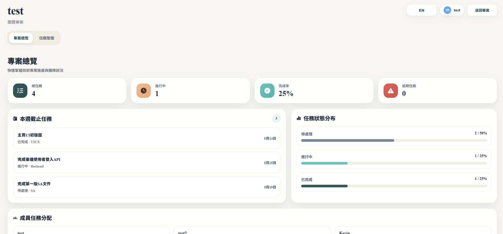
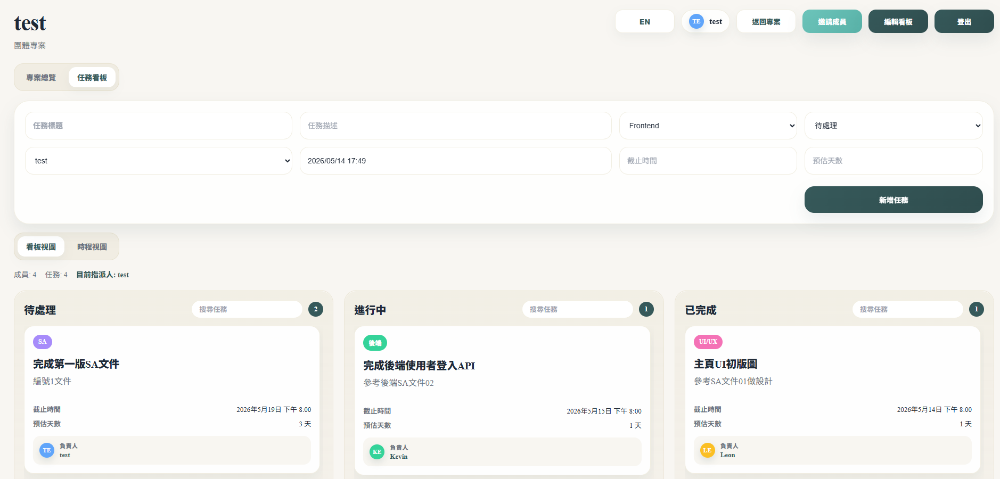
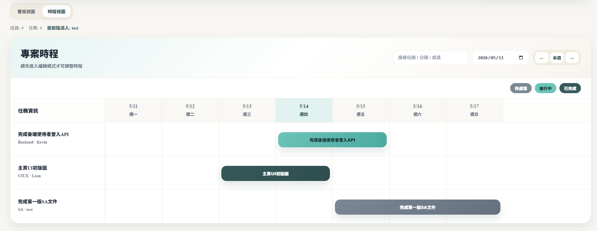

# TeamFlow Frontend

TeamFlow Frontend 是一套專案管理系統的前端應用，支援專案總覽、Kanban、Timeline、團隊邀請與任務留言。

---

## Live Demo

Frontend: https://teamflow-frontend-ekszko8ne-fad1765s-projects.vercel.app/
Backend API: https://teamflow-backend-kuhz.onrender.com/
Swagger: https://teamflow-backend-kuhz.onrender.com/docs

※ Backend 部署於 Render free tier，首次請求可能需等待啟動（cold start）

---

## 專案特色

- React + Vite 建立高效 SPA 架構
- FastAPI API 串接
- Kanban / Timeline / Dashboard
- 完整 UX（Toast / Modal / Skeleton）
- Docker + GitHub Actions

---

## 核心功能

### 使用者
- JWT 登入驗證
- localStorage 狀態管理
- 中英文切換

### 專案
- 個人 / 團隊專案
- 專案列表 / 描述
- Overview Dashboard

### Dashboard
- 完成率
- 逾期任務
- 任務統計
- 成員分配

### Kanban
- dnd-kit 拖拉
- position-based ordering
- Edit Mode

### Timeline
- 週視圖
- 任務區間顯示
- 拖拉調整時程

### 協作
- Email 邀請
- 留言 / 按讚

---

## 技術

- React / Vite / Router
- Axios / Context API
- dnd-kit / date-fns
- Docker / GitHub Actions / GHCR

---

## 本機開發

```bash
npm install
npm run dev
```

## 環境變數

```env
VITE_API_BASE_URL=your_backend_url
```

## Docker

```bash
docker build -t teamflow-frontend .
```

## 架構

```text
Vercel Frontend
      ↓
Render Backend
      ↓
PostgreSQL
```

## 專案亮點

- Kanban 拖拉排序（position 設計）
- Timeline 任務區間視覺化
- 全域 Toast UX 系統
- CI/CD 自動化部署

## 畫面展示

### Dashboard


### Kanban


### Timeline


## 未來規劃

- WebSocket 即時同步
- 通知系統
- PM Dashboard